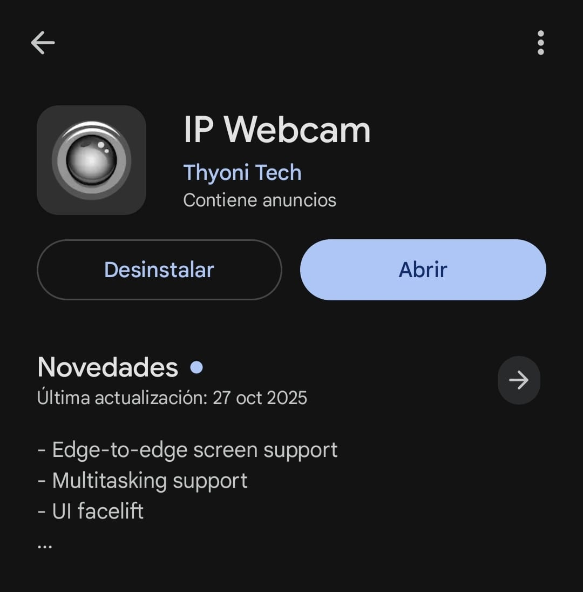

# Deteccion-de-incendios-IOT
---

<!-- TABLA DE CONTENIDOS -->
<!-- TABLA DE CONTENIDOS -->
<details>
  <summary>Tabla de Contenidos</summary>
  <ol>
    <li>
      <a href="#1-acerca-del-proyecto">1. Acerca del Proyecto</a>
      <ol>
        <li><a href="#11-descripcion-general-del-sistema">1.1 Descripción General del Sistema</a></li>
        <li><a href="#12-arquitectura-del-sistema">1.2 Arquitectura del Sistema</a></li>
        <li><a href="#13-tecnologias-utilizadas">1.3 Tecnologías Utilizadas</a></li>
      </ol>
    </li>
    <li>
      <a href="#2-primeros-pasos">2. Primeros Pasos</a>
      <ol>
        <li><a href="#21-requisitos-previos">2.1 Requisitos Previos</a></li>
        <li><a href="#22-instalacion">2.2 Instalación</a></li>
      </ol>
    </li>
    <li>
      <a href="#3-uso-del-sistema">3. Uso del Sistema</a>
      <ol>
        <li><a href="#31-estado-de-monitoreo-normal">3.1 Estado de Monitoreo Normal</a></li>
        <li><a href="#32-estado-de-deteccion-de-riesgo">3.2 Estado de Detección de Riesgo</a></li>
        <li><a href="#33-captura-multimedia">3.3 Captura Multimedia</a></li>
        <li><a href="#34-confirmacion-de-incendio">3.4 Confirmación de Incendio</a></li>
        <li><a href="#35-envio-de-alertas">3.5 Envío de Alertas</a></li>
      </ol>
    </li>
    <li><a href="#4-hoja-de-ruta">4. Hoja de Ruta</a></li>
    <li><a href="#5-contribuciones">5. Contribuciones</a></li>
    <li><a href="#6-licencia">6. Licencia</a></li>
    <li><a href="#7-contacto">7. Contacto</a></li>
    <li><a href="#8-agradecimientos">8. Agradecimientos</a></li>
  </ol>
</details>


## 1. Acerca del Proyecto
### 1.1 Descripción General del Sistema
### 1.2 Arquitectura del Sistema
### 1.3 Tecnologías Utilizadas

## 2. Primeros Pasos
### 2.1 Requisitos Previos
### 2.2 Instalación

## 3. Uso del Sistema
### 3.1 Estado de Monitoreo Normal
### 3.2 Estado de Detección de Riesgo
### 3.3 Captura Multimedia
### 3.4 Confirmación de Incendio
### 3.5 Envío de Alertas

## 4. Hoja de Ruta
## 5. Contribuciones
## 6. Licencia
## 7. Contacto
## 8. Agradecimientos


### ⚙️ Funcionamiento
1. El sistema se suscribe a un tópico MQTT y recibe datos en formato JSON.
2. Se evalúan los valores de temperatura, humedad y luz según umbrales definidos.
3. Si las condiciones de riesgo se mantienen durante varias lecturas consecutivas, se confirma la alerta.
4. Ante una alerta confirmada:
   - Se detecta el riesgo de incendio.
   - Se analiza la humedad ambiental.
   - Se captura una imagen desde la cámara IP.

     

   - Se graba un archivo de audio.
5. El sistema evita alertas repetidas hasta que las condiciones vuelvan a la normalidad.

---

### Datos esperados (MQTT)
El sistema espera mensajes en formato JSON con la siguiente estructura:

```json

{
  "temp": 45,
  "hum": 18,
  "luz": 2300
}