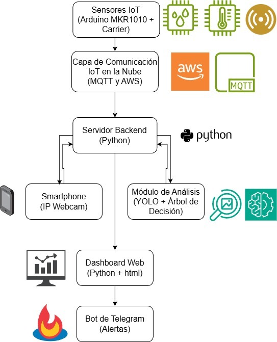
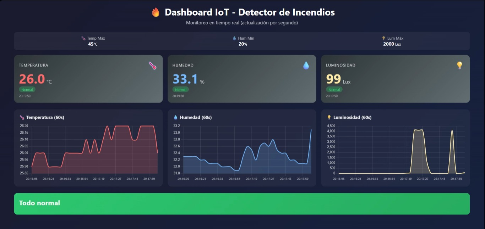
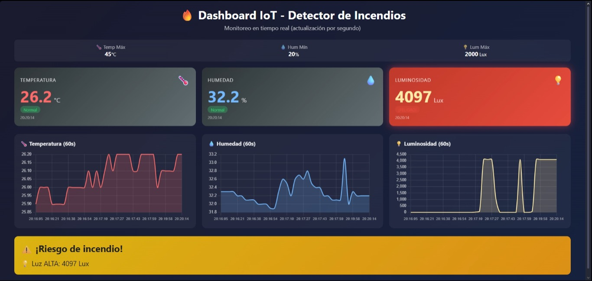
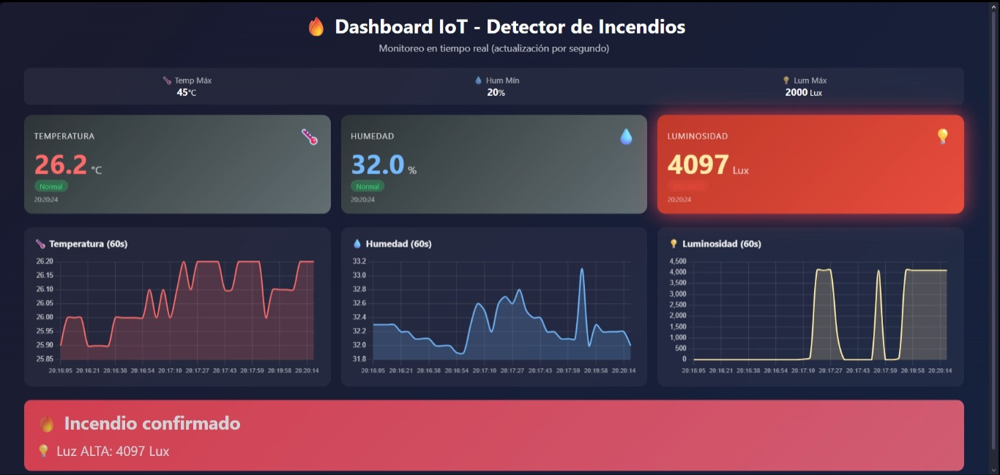
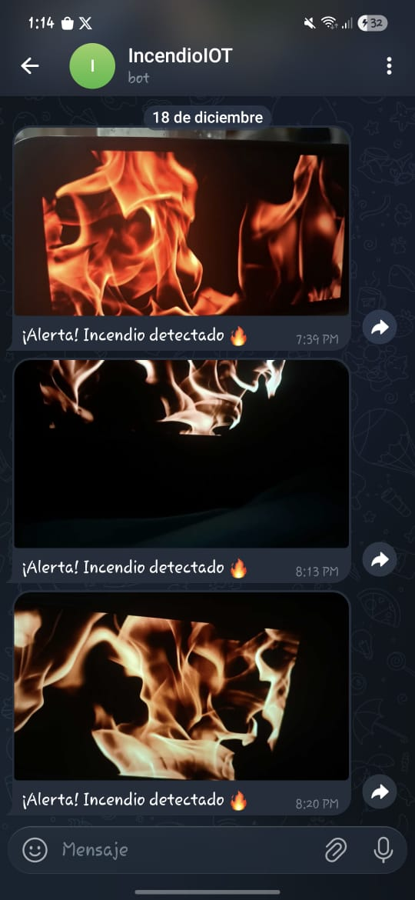

# Deteccion-de-incendios-IOT
---

<!-- TABLA DE CONTENIDOS -->
<!-- TABLA DE CONTENIDOS -->
<details>
  <summary>Tabla de Contenidos</summary>
  <ol>
    <li>
      <a href="#1-acerca-del-proyecto">1. Acerca del Proyecto</a>
      <ol>
        <li><a href="#11-descripcion-general-del-sistema">1.1 Descripción General del Sistema</a></li>
        <li><a href="#12-arquitectura-del-sistema">1.2 Arquitectura del Sistema</a></li>
        <li><a href="#13-tecnologias-utilizadas">1.3 Tecnologías Utilizadas</a></li>
      </ol>
    </li>
    <li>
      <a href="#2-primeros-pasos">2. Primeros Pasos</a>
      <ol>
        <li><a href="#21-requisitos-previos">2.1 Requisitos Previos</a></li>
        <li><a href="#22-instalacion">2.2 Instalación</a></li>
      </ol>
    </li>
    <li>
      <a href="#3-uso-del-sistema">3. Uso del Sistema</a>
      <ol>
        <li><a href="#31-estado-de-monitoreo-normal">3.1 Estado de Monitoreo Normal</a></li>
        <li><a href="#32-estado-de-deteccion-de-riesgo">3.2 Estado de Detección de Riesgo</a></li>
        <li><a href="#33-captura-multimedia">3.3 Captura Multimedia</a></li>
        <li><a href="#34-confirmacion-de-incendio">3.4 Confirmación de Incendio</a></li>
        <li><a href="#35-envio-de-alertas">3.5 Envío de Alertas</a></li>
      </ol>
    </li>
  </ol>
</details>

## Integrantes:
  - Wilson Ramos Pacco
  - Owen Haziel Roque Sosa
  - Javier Wilber Quispe Rojas
  - Patrik Rene Ramirez Zarate
  - Evelyn Lizbeth Cusi Hancco
  - Angela Solange Sucso Choque

## 1. Acerca del Proyecto
### 1.1 Descripción General del Sistema

El sistema de Detección de Incendios IoT es una plataforma avanzada diseñada para la detección temprana y automática de incendios en espacios monitoreados. Combina sensores IoT conectados a dispositivos Arduino que recopilan datos ambientales en tiempo real, como temperatura, lintensidad de luz otros indicadores de riesgo. Estos datos se procesan mediante algoritmos de inteligencia artificial especializados en visión por computadora (usando YOLOv8 para detección de fuego en imágenes) y análisis de audio. El sistema integra notificaciones instantáneas vía Telegram y almacena evidencias en la nube usando AWS S3, con procesamiento adicional posible mediante AWS Lambda. La arquitectura modular permite escalabilidad y facilidad de mantenimiento, ideal para aplicaciones en hogares, industrias o espacios públicos.

### 1.2 Arquitectura del Sistema

La arquitectura del sistema se basa en una estructura distribuida y modular que integra hardware IoT, procesamiento en la nube y aplicaciones de usuario. Los componentes principales incluyen:

- **Sensores y Hardware IoT**: Dispositivos Arduino MKR1010 WiFi equipados con sensores de temperatura, humo y otros, que envían datos vía MQTT a través de un broker local (Mosquitto) o directamente a AWS IoT Core.

- **Puente MQTT**: Script `mqtt.py` que actúa como intermediario entre Mosquitto y AWS IoT Core, asegurando la transmisión segura de datos.

- **Backend Principal**: Script `main.py` en Python que recibe los datos MQTT, coordina la detección de incendios mediante módulos especializados, y maneja el almacenamiento en AWS S3 y notificaciones.

- **Módulos de Detección**:
  - **Detección por Imagen**: Utiliza YOLOv8 para analizar imágenes capturadas y confirmar presencia de fuego.
  - **Detección por Audio**: Emplea modelos de machine learning (RandomForest) entrenados con Librosa para procesar grabaciones de audio.

- **Frontend y Visualización**: Dashboard web simple (`front-end/index.html`) para monitoreo en tiempo real, y una interfaz Streamlit (`DeteccionImagen/main.py`) para pruebas de detección por imagen.

- **Notificaciones y Almacenamiento**: Integración con Telegram Bot API para alertas, y AWS S3 para guardar imágenes y videos de evidencia.

- **Flujo de Datos**: Sensores → MQTT → Backend → Detección IA → Almacenamiento/Notificaciones.

Esta arquitectura permite un sistema robusto, escalable y eficiente para la prevención de incendios.

  
  

### 1.3 Tecnologías Utilizadas

- **Lenguaje**
  - Python: lenguaje principal usado en backend, procesamiento y scripts.

- **Backend & servidor**
  - Flask, Flask-SocketIO, Flask-CORS, Werkzeug

- **Frontend & visualización**
  - HTML / CSS (carpeta `front-end`)
  - Streamlit (interfaz en `DeteccionImagen`)

- **Detección por imagen (Visión por Computadora)**
  - Ultralytics YOLOv8 (`ultralytics`)
  - Modelo entrenado: `models/yolov8s_best.pt`
  - OpenCV (`opencv-python`), Pillow

- **Detección por audio (ML)**
  - Librosa, NumPy, scikit-learn (RandomForest)
  - Scripts en `DeteccionAudio`

- **Análisis de datos**
  - pandas, plotly

- **Integración & utilidades**
  - python-dotenv, python-engineio

- **Notificaciones**
  - Telegram Bot API (implementación en `telegram_message.py`)

- **Soporte de audio**
  - soundfile (`libsndfile`) y dependencias de `librosa`

- **Video / fuentes externas**
  - pytube (descarga de YouTube para pruebas)

- **IoT & hardware**
  - Arduino MKR1010 WiFi (sketch en `scriptArduino/sensoresIncendio.ino`)
  - MQTT Bridge (implementación en `mqtt.py` para conectar Arduino con AWS IoT Core via Mosquitto)

- **Cloud & AWS Integration**
  - AWS IoT Core (MQTT broker para comunicación IoT)
  - AWS S3 (almacenamiento de imágenes y videos)
  - AWS Lambda (procesamiento serverless opcional)
  - boto3 (SDK de AWS para Python)
  - awsiot, awscrt (SDK de AWS IoT para Python)
  - paho-mqtt (cliente MQTT para Mosquitto)
  - Mosquitto MQTT Broker (puente local para sensores Arduino)

- **Estructura del proyecto (referencia rápida)**
  - Backend: `backend/app.py`
  - Frontend estático: `front-end/index.html`
  - Datasets: `dataset/`, `DeteccionImagen/datasets`

## 2. Primeros Pasos
### 2.1 Requisitos Previos
- **Python** 3.10+ instalado.
- **pip** y herramienta de entornos virtuales (`venv` o `virtualenv`).
- **Git** (para clonar el repositorio).
- **Dependencias del sistema** para audio/video: `libsndfile` (para `soundfile`/`librosa`) y `ffmpeg` (opcional, para manejo de video). En Windows puede requerirse instalar Visual C++ Build Tools.
- **Opcional (GPU)**: drivers CUDA y versión de PyTorch compatible si se desea acelerar la detección por imagen.
- **Arduino IDE** para programar el sketch `scriptArduino/sensoresIncendio.ino`.
- Cámara IP o webcam para pruebas de video (si aplica).
- Variables de entorno para integraciones (p. ej. token de Telegram).
- **Cuenta AWS** con servicios IoT Core, S3, y Lambda activados (opcional para integración cloud).
- **Certificados AWS IoT** descargados y colocados en la raíz del proyecto (`arduino-incendio.cert.pem`, `arduino-incendio.private.key`, `root-CA.crt`) si se usa AWS.
- **Mosquitto MQTT Broker** (usando `test.mosquitto.org` para pruebas; opcional instalar localmente desde https://mosquitto.org/).

### 2.2 Instalación
1. Clonar el repositorio:
```bash
git clone <repo-url>
cd Deteccion-de-incendios-IOT
```

2. Crear y activar un entorno virtual (Windows):
```powershell
python -m venv .venv
.venv\Scripts\Activate.ps1   # PowerShell
# o
.venv\Scripts\activate.bat   # CMD
```

3. Actualizar `pip` e instalar dependencias principales:
```bash
python -m pip install --upgrade pip
pip install -r requirements.txt
pip install -r DeteccionImagen/requirements.txt
```

4. (Opcional) Instalar dependencias del sistema para audio/video:
- Windows: instalar `libsndfile`/paquetes redistribuibles según la guía de cada librería.
- Linux/macOS: usar `apt`, `brew` o el gestor correspondiente (`libsndfile`, `ffmpeg`).

5. Configurar variables de entorno (archivo `.env` recomendado). Ejemplo completo:
```
TELEGRAM_TOKEN=xxxxx
TELEGRAM_CHAT_ID=yyyyy
MQTT_BROKER=broker.example.com
MQTT_PORT=1883
AWS_IOT_ENDPOINT=a1b9nxragudit3-ats.iot.us-east-1.amazonaws.com
AWS_S3_BUCKET=your-incendio-bucket
AWS_REGION=us-east-1
```

5.5 Configurar AWS (opcional, si se usa integración cloud):
- Crear una "Thing" en AWS IoT Console y asociar los certificados descargados.
- Crear bucket S3 y actualizar `AWS_S3_BUCKET` en `.env`.
- Configurar función Lambda si se desea procesamiento serverless adicional.

6. Ejecutar componentes:
- Backend / monitor (desde la raíz — si usas el script principal):
```bash
python main.py
```
- Interfaz de detección por imagen (Streamlit):
```bash
streamlit run DeteccionImagen/main.py
```
- Entrenamiento o pruebas de audio:
```bash
python DeteccionAudio/entrenar_modelo.py
```
- Subir código al Arduino: abrir `scriptArduino/sensoresIncendio.ino` en el Arduino IDE y cargar al dispositivo.
- Puente MQTT (para conectar Arduino con AWS via Mosquitto):
```bash
python mqtt.py
```

7. Notas:
- Para detección de imágenes con GPU, instala la versión de `torch` compatible con tu CUDA y reinicia.
- Al usar IP Webcam app, actualiza la URL/credenciales en la configuración correspondiente.

## 3. Uso del Sistema
### 3.1 Estado de Monitoreo Normal
 
  

Estado de operación estándar con sensores dentro de los umbrales definidos. No hay alertas; el dashboard muestra señales verdes y el sistema permanece en modo monitoreo.

### 3.2 Estado de Detección de Riesgo
 
  

Señal de riesgo detectada (por ejemplo, temperatura o luz fuera de rango). El sistema marca la lectura como sospechosa y prepara captura multimedia para confirmar el evento.

### 3.3 Captura Multimedia

📷 **Imagen confirmada**
<br>


🎧 **Audio de incendio**
<br>
🔊 [audio_incendio.wav](audio_incendio.wav)

Cuando se detecta riesgo, el sistema guarda una fotografía (`confirmado.jpeg`) y graba un audio (`audio_incendio.wav`) para análisis posterior.

### 3.4 Confirmación de Incendio

  

Imagen anotada que confirma la presencia de fuego (cajas de detección, etiquetas y probabilidades). Tras esta etapa el sistema procede a generar y enviar alertas.

### 3.5 Envío de Alertas
  
  

Notificación enviada al usuario vía Telegram con foto y mensaje informando la detección confirmada.